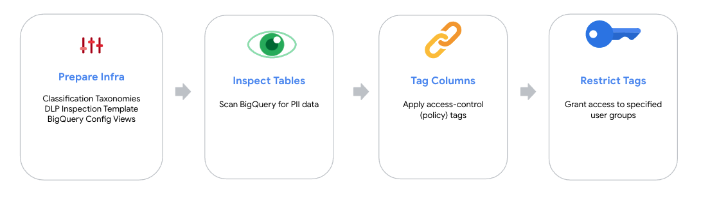

# BigQuery PII Classifier

## Overview

BigQuery PII Classifier is an OSS solution to automate the process of discovering and tagging
PII data across BigQuery tables and applying column-level access controls to restrict 
specific PII data types to certain users/groups in certain domains (e.g. business units)
based on the confidentiality level of that PII.

Main Steps:

1. *Data Classification Taxonomy and User Access Configuration:*  
   Declare a taxonomy/hierarchy for PII types, and their confidentiality levels which can be modified and extended by customers to allow for custom PII types. 
2. *BigQuery Tables Inspection:*  
   Scan & automatically discover PII data based on the defined data classification taxonomy
3. *Columns Tagging:*  
   Applying access-control tags to columns in accordance with data classification 
4. *Enforcing Column-level Access Control:*  
    Limit PII data access to specific groups based on domains and data classification (e.g. Marketing High Confidentiality PII Readers, Finance Low Confidentiality PII Readers)  

## Solution Modes
The solution comes with two modes, [standard-mode](guide-standard-dlp.md) and [auto-dlp-mode](guide-auto-dlp.md).

### Standard Mode

In standard-mode, the solution scope is:
* Automation of DLP inspection for tables (given an array of configurations)
* Applying policy tags to columns based on the PII types detected by the DLP inspection jobs
* Restricting access to the tagged columns based on the confidentiality level
* Possibility to trigger a "re-tagging" run that uses the last inspection results to overwrite the column policy tags.

For more details and on how to use the solution in `standard mode` follow the [Standard-mode guide](docs/guide-standard-dlp.md).

### Auto-DLP Mode 

In auto-dlp mode, the solution scope is:
* Not managing tables inspection, instead it will build on top of Auto-DLP data profiles (Auto-DLP is managed outside of the solution).
* Apply policy tags to columns based on the PII types detected by Auto-DLP data profiles.
* Restricting access to the tagged columns based on the confidentiality level

For more details and on how to use the solution in `auto-dlp mode` follow the [Auto-dlp mode guide](docs/guide-auto-dlp.md).

### Which mode to use?

Using `Standard-mode` offers the following benefits:
* **Granular BigQuery scan scope**. Standard-mode could be configured to include/exclude projects, datasets and tables. Where in Auto-DLP, configurations 
are on Organization, folder and project levels. 
* **Control over DLP sampling size**. Standard-mode let you configure the DLP scan sample size as a function of the table size. For example, full scans of smaller tables
and sampling a lower percentage/number of records for bigger tables. This feature let you estimate and control DLP inspection cost to a higher degree.
* **Control over scan schedules**. Standard-mode enables you to call an entry-point service (i.e. Inspection Dispatcher) with different scan scopes on different schedules.
For example, historical dump tables could be scanned once every x month vs daily-refreshed tables could be scanned every x days.
* **On demand scans**. Standard-mode enables you to invoke an entry-point service on-demand. For example, after a data pipeline 
finishes you could trigger a call to scan only the table(s) affected by that pipeline.    

Using `Auto-dlp mode` offers the following benefits:
* Relying on scalable, native GCP product for inspection/profiling.
* Relying on Auto-DLP heuristics to determine when to trigger a table scan. 
* visualizing data profiles (i.e. tables, columns, PII types, metrics, etc) from the GCP console (UI).
* Accessing GCP Cloud Support for the product (Auto-DLP only, not this custom solution).

## Data Access Model Example
 
  Check out this [document](docs/common-iam-example.md) for an example on a data access
  model across domains and IAM group structure.

 ## Solution Limits
  
 Check out this [document](docs/common-limits.md) for solution limits.
 
 ## GCP Quotas
 
 Check out this [document](docs/common-quotas.md) for related GCP Quotas.