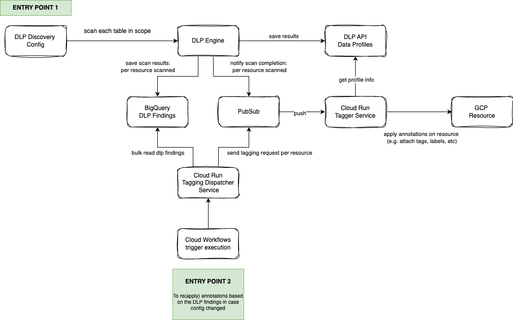
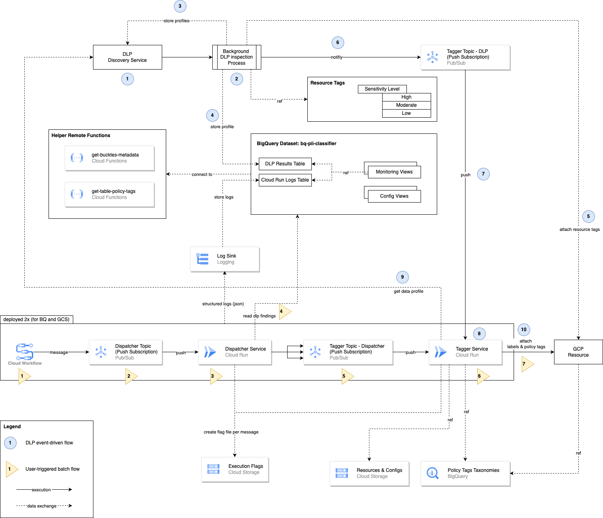

# GCP PII Classifier

## Overview

GCP PII Classifier is an open-source solution that automates the process of discovering, classifying and annotating
sensitive data across GCP data storage systems using the power of [Cloud DLP Discovery Service](https://cloud.google.com/sensitive-data-protection/docs/data-profiles). It currently supports BigQuery tables and Cloud Storage buckets.

The solution uses Terraform to configure the DLP discovery configurations, used to scan BigQuery and/or Cloud Storage, 
and deploys extra services that automate the process of acting upon the DLP findings by applying annotations to the scanned resources.

The following "annotations" are supported by this solution:
* [Resource Tags](https://cloud.google.com/resource-manager/docs/tags/tags-creating-and-managing): A tag is a pre-defined key-value pair that can be attached to a Google Cloud resource. You can use tags to conditionally allow or deny policies based on whether a supported resource has a specific tag. (e.g. for Attribute based access control - ABAC)
* [Resource Labels](https://cloud.google.com/bigquery/docs/labels-intro): Labels are free-form key-value pairs that you can attach to a resource as metadata. For example, For example, you can use labels to group resources by data sensitivity, identifiability or risk levels.
* [BigQuery Policy Tags](https://cloud.google.com/bigquery/docs/column-level-security-intro): Used for column-level access control on BigQuery tables (e.g. restrict access to sensitive columns to certain users/groups)

### High-level Architecture

### Technical Architecture

#### DLP Discovery Service
The GCP product responsible for scanning data resources and creating data profiles. It shows what sensitive data types are found in scanned assets.

#### Tagger Service
A Cloud Run service that is used to apply annotations to the scanned resources according to the DLP findings.

#### BigQuery Policy Tags Taxonomies
Taxonomies are logical groupings of policy tags that could be attached to BigQuery columns. These created taxonomies are heirarcial and 
corresponds to the user configuration of DLP info types and their classification.

#### Dispatcher Service 
A Cloud Run service that starts a bulk re-annotation process based on existing DLP results. It reads DLP data profiles from BigQuery and submits one request
per profile to the Tagger service. The scope of profiles to re-process is configurable as parameters.

#### Cloud Workflows
A serverless and light-weight workflow to trigger the Dispatcher service execution and passing the processing scope to it.

#### PubSub
PubSub topics and push subscriptions are used across the solution to decouple execution steps. It acts as a task queue
for annotation requests and allows retries on re-triable errors as well as replays.

#### Execution Flags Bucket
To reduce the number of duplicate PubSub message processing, each Cloud Run request will create an empty file named after the PubSub message ID
that invoked the service after successfully processing it. The Cloud Run service will check for the existence of such flag file before processing any
message and ignore the request if it has been processed already.

#### Resource & Configs Bucket
A Cloud Storage bucket containing large configurations that don't fit as environment variables in Cloud Run. For example, DLP info types mapping to labels
and policy tags

#### Log Sink to BigQuery
All CLoud Run services are generating structured logs (JSON log messages) to Cloud Logging. These logs are routed to a BigQuery dataset
to help monitoring the solution execution using SQL views.

#### BigQuery Dataset
A dataset that hosts tables and views used by the solution. For example, Cloud Run logging table, DLP results and monitoring views.

#### BigQuery Helper Functions
These are Cloud Functions that are used as remote-functions in BigQuery to run certain analytics before or after solution execution. For example,
collecting a project's buckets metadata (including labels) to compare the before and after annotations snapshots and measure coverage/impact. 
Same for BigQuery tables and policy tags before and after solution execution.

## Deployment

Follow the [deployment guide](docs/terraform-1-prepare.md) to configure and deploy the solution to Google Cloud Platform.

## Usage

There are two entry points of execution after deploying the solution:

### DLP Events

This is an event-driven execution where DLP Discovery Service sends a pubsub notification
after it inspects a certain resource (i.e. table or bucket) and creates a data profile for it.

This notification is processed by the `Tagger` service and applies the configured annotations
(i.e. policy tags and/or resource labels) to the target resource based on DLP findings.

Note that one can't force-run DLP discovery service, so it might take time between the deployment
of the DLP discovery configuration and its scan.

### Tagging Dispatcher

The `Tagging Dispatcher` service is a mechanism to force-run the annotation process
on pre-existing DLP findings.

This could be used to invoke the annotation process without re-scanning data with DLP. For example:
* When annotation configuration has hanged (e.g. new labels, new classification level for policy tags, etc)
* When `Tagger` fails the first time due to missing permissions on certain data projects/folders

Cloud Workflows is used to manually invoke this process:
* In the host project, go to "Cloud Workflows"
* Open the BigQuery or GCS tagging dispatcher workflow
* Click the "Execute" button on top
* Inspect the annotation scope in the "message" field under "Code"
* To override the scope pass a JSON object with the attributes as the message in the "Input" tab
* * For example `{"projectsRegex": "^prod-", "bucketsRegex": ".*"}`
* Click the "Execute" button in the bottom

## Reporting

Check out this [document](docs/common-reporting.md) for example queries on:
* How to monitor execution steps
* How to detect broken execution steps (e.g. tables that were not tagged)
* Displaying a log of all tagging actions and sensitive data findings by the solution

