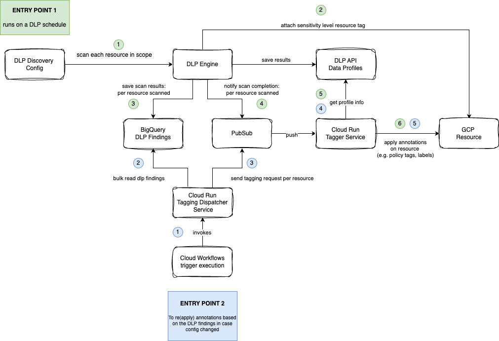
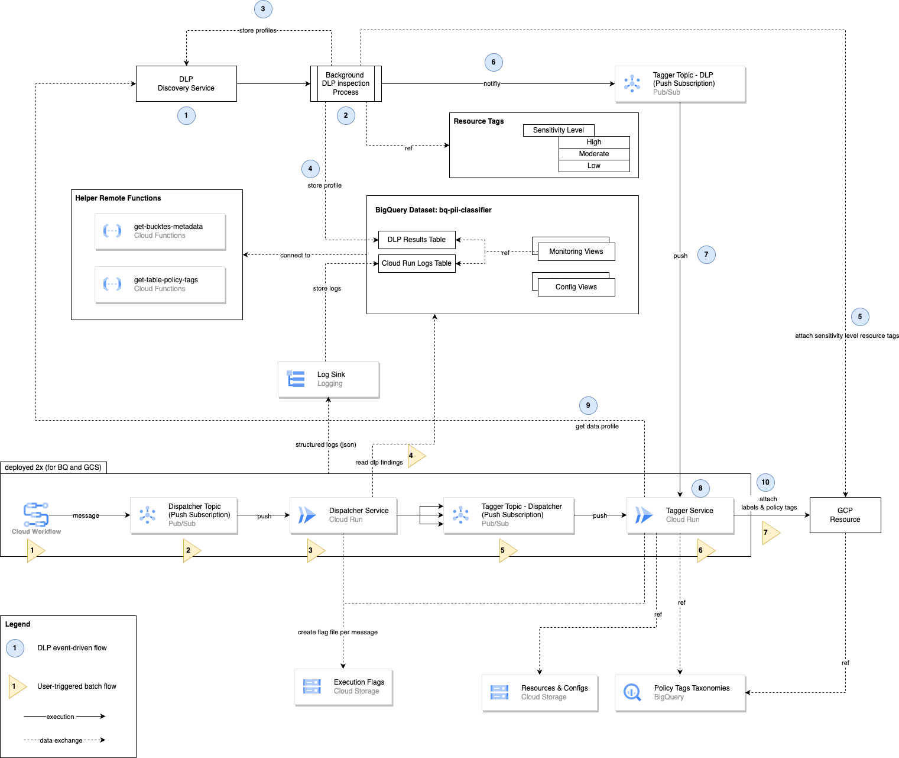
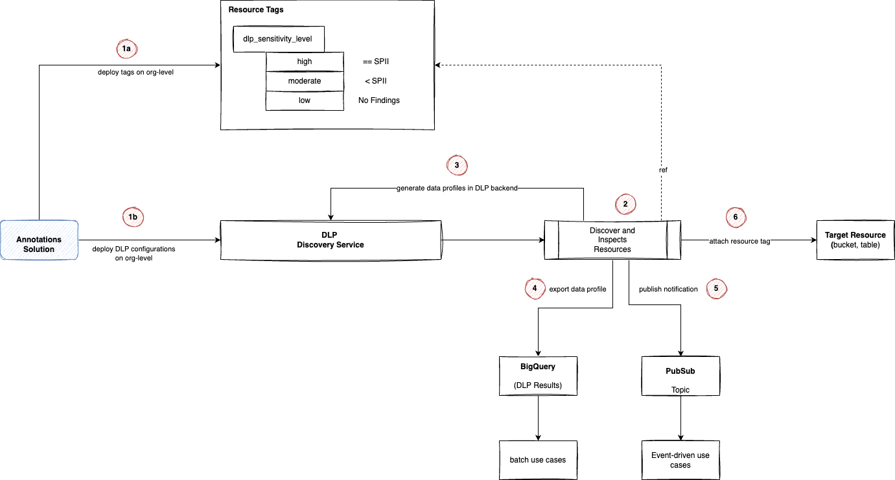

# GCP PII Classifier

<!-- TOC -->
* [GCP PII Classifier](#gcp-pii-classifier)
  * [Overview](#overview)
    * [Main Updates from v2.x](#main-updates-from-v2x)
    * [Annotations](#annotations)
    * [Solution High-level Architecture](#solution-high-level-architecture)
    * [Solution Technical Architecture](#solution-technical-architecture)
      * [DLP Discovery Service](#dlp-discovery-service)
      * [Tagger Service](#tagger-service)
      * [BigQuery Policy Tags Taxonomies](#bigquery-policy-tags-taxonomies)
      * [Dispatcher Service](#dispatcher-service)
      * [Cloud Workflows](#cloud-workflows)
      * [PubSub](#pubsub)
      * [Execution Flags Bucket](#execution-flags-bucket)
      * [Resource & Configs Bucket](#resource--configs-bucket)
      * [Log Sink to BigQuery](#log-sink-to-bigquery)
      * [BigQuery Dataset](#bigquery-dataset)
      * [BigQuery Helper Functions](#bigquery-helper-functions)
  * [Deployment](#deployment)
    * [Deployment Overview](#deployment-overview)
    * [Partial deployment example](#partial-deployment-example)
    * [Full deployment example](#full-deployment-example)
  * [Usage](#usage)
    * [DLP Events](#dlp-events)
    * [Tagging Dispatcher](#tagging-dispatcher)
  * [Reporting](#reporting)
    * [Helpful in monitoring active runs](#helpful-in-monitoring-active-runs)
    * [Helpful in investigating issues](#helpful-in-investigating-issues)
    * [Execution duration per function](#execution-duration-per-function)
  * [New Environment Deployment Guide {#new-env-deployment-guide}](#new-environment-deployment-guide-new-env-deployment-guide)
    * [Create project(s)](#create-projects)
    * [Permissions on host project](#permissions-on-host-project)
    * [Environment setup](#environment-setup)
    * [Enable APIs](#enable-apis)
    * [Create Terraform State Bucket](#create-terraform-state-bucket)
    * [Prepare a Terraform Service Account](#prepare-a-terraform-service-account)
      * [Create a dedicated Terraform Service Account in the host project](#create-a-dedicated-terraform-service-account-in-the-host-project)
        * [Grant Terraform Service Account permissions on the publishing project](#grant-terraform-service-account-permissions-on-the-publishing-project)
        * [Grant the Terraform Service Account Org Permissions](#grant-the-terraform-service-account-org-permissions)
      * [Use an existing Terraform Service Account](#use-an-existing-terraform-service-account)
      * [Linking Terraform SA](#linking-terraform-sa)
    * [Deploy Services Image (optional)](#deploy-services-image-optional)
      * [Create a Docker Repo](#create-a-docker-repo)
      * [Deploy the services container image](#deploy-the-services-container-image)
    * [Create new Terraform environment](#create-new-terraform-environment)
    * [Modules selection](#modules-selection)
    * [Modules configuration](#modules-configuration)
    * [Running Terraform](#running-terraform)
<!-- TOC -->

## Overview

GCP PII Classifier automates the process of discovering, classifying and
annotating sensitive data across GCP data storage systems using the power of
[Cloud DLP Discovery Service](https://cloud.google.com/sensitive-data-protection/docs/data-profiles).
It currently supports BigQuery tables and Cloud Storage buckets.

The solution sets up folder-level Cloud DLP discovery configurations (via Terraform), used
to scan BigQuery and/or Cloud Storage, and uses custom-built Cloud Run services (Java) that process
the Cloud DLP findings and apply [annotations](#annotations) to the scanned tables/buckets.

### Main Updates from v2.x

This release of the solution (v3.x) has many breaking changes, new capabilities and capabilities that is no longer
supported. Therefore, it's recommended to deploy as a new stand-alone solution and not as an upgrade from v2.x.

Major updates include:
* Relying solely on Cloud DLP discovery service (previously `auto-dlp` mode). Cloud DLP inspection jobs
(previously `standard` mode) is no longer used by the solution.
* Cloud Storage DLP discovery is now supported, next to BigQuery discovery.
* Annotations are extended from only BigQuery policy tags to include now cloud labels and DLP data sensitivity
levels tags. 

### Annotations

Annotations are metadata fields the describes the underlying data asset and/or used for attribute based access control
(ABAC). In this solution we are mapping Cloud DLP discovery results to desired annotations.

The following implementations of "annotations" are supported by the solution:

*   [Resource Tags](https://cloud.google.com/resource-manager/docs/tags/tags-creating-and-managing):
    A tag is a pre-defined key-value pair that can be attached to a Google Cloud
    resource. You can use tags to conditionally allow or deny policies based on
    whether a supported resource has a specific tag. (e.g. for Attribute based
    access control - ABAC)
*   [Resource Labels](https://cloud.google.com/bigquery/docs/labels-intro):
    Labels are free-form key-value pairs that you can attach to a resource as
    metadata. For example, For example, you can use labels to group resources by
    data sensitivity, identifiability or risk levels.
*   [BigQuery Policy Tags](https://cloud.google.com/bigquery/docs/column-level-security-intro):
    Used for column-level access control on BigQuery tables (e.g. restrict
    access to sensitive columns to certain users/groups)


### Solution High-level Architecture



### Solution Technical Architecture



#### DLP Discovery Service

The GCP product responsible for scanning data resources and creating data
profiles. It shows what sensitive data types are found in scanned assets.

#### Tagger Service

A Cloud Run service that is used to apply annotations to the scanned resources
according to the DLP findings.

#### BigQuery Policy Tags Taxonomies

Taxonomies are logical groupings of policy tags that could be attached to
BigQuery columns. These created taxonomies are heirarcial and corresponds to the
user configuration of DLP info types and their classification.

#### Dispatcher Service

A Cloud Run service that starts a bulk re-annotation process based on existing
DLP results. It reads DLP data profiles from BigQuery and submits one request
per profile to the Tagger service. The scope of profiles to re-process is
configurable as parameters.

#### Cloud Workflows

A serverless and light-weight workflow to trigger the Dispatcher service
execution and passing the processing scope to it.

#### PubSub

PubSub topics and push subscriptions are used across the solution to decouple
execution steps. It acts as a task queue for annotation requests and allows
retries on re-triable errors as well as replays.

#### Execution Flags Bucket

To reduce the number of duplicate PubSub message processing, each Cloud Run
request will create an empty file named after the PubSub message ID that invoked
the service after successfully processing it. The Cloud Run service will check
for the existence of such flag file before processing any message and ignore the
request if it has been processed already.

#### Resource & Configs Bucket

A Cloud Storage bucket containing large configurations that don't fit as
environment variables in Cloud Run. For example, DLP info types mapping to
labels and policy tags

#### Log Sink to BigQuery

All CLoud Run services are generating structured logs (JSON log messages) to
Cloud Logging. These logs are routed to a BigQuery dataset to help monitoring
the solution execution using SQL views.

#### BigQuery Dataset

A dataset that hosts tables and views used by the solution. For example, Cloud
Run logging table, DLP results and monitoring views.

#### BigQuery Helper Functions

These are Cloud Functions that are used as remote-functions in BigQuery to run
certain analytics before or after solution execution. For example, collecting a
project's buckets metadata (including labels) to compare the before and after
annotations snapshots and measure coverage/impact. Same for BigQuery tables and
policy tags before and after solution execution.

## Deployment

### Deployment Overview

To cater for different organizations, with different code repositories and tooling,
the solution is divided into building blocks (i.e. Terraform modules) that can be hosted
and deployed separately. These Terraform modules are:

Module                                                                             | Description
---------------------------------------------------------------------------------- | -----------
[APIs](terraform/modules/terraform_00_apis)                                        | enables required APIs
[IAM on host project](terraform/modules/terraform_01_iam_host_project)             | creates service accounts and project level IAM on the DLP agent and compute project
[IAM on publishing project](terraform/modules/terraform_02_iam_publishing_project) | creates service accounts and project level IAM on the project hosting the DLP results
[Tags](terraform/modules/terraform_03a_tags)                                       | creates DLP data sensitivity tags on org level
[Tags IAM](terraform/modules/terraform_03b_tags_iam)                               | grant service accounts used by the solution required permissions on the created tags
[DLP](terraform/modules/terraform_04_dlp)                                          | creates DLP folder-level discovery configurations on the org node and the BigQuery results dataset
[Annotations infra](terraform/modules/terraform_05_annotations_infra)              | creates Cloud Run services to act on DLP notifications and custom annotate resources
[IAM on Org](terraform/modules/terraform_06_iam_org_level)                         | grants service accounts used by the solution required permissions on the org level
[IAM on data folders](terraform/modules/terraform_07_iam_folder_level)             | grants service accounts used by the solution required permissions on the data folders

### Partial deployment example

In this example, we assume an organization where only the Cloud DLP discovery configurations
are required along with the application of Cloud DLP sensitivity level tags to the
scanned resources (using the native tagging feature in Cloud DLP). In this case, no cloud labels
or BigQuery policy tags are required.



To achieve that, all modules will be needed except for the `Annotations Infra` one.
These modules could be deployed in one Terraform environment or integrated where appropriate
in your organizations.

An example of such deployment is found under
[terraform/envs_example/partial](terraform/envs_example/partial/main.tf) environment.

### Full deployment example

In this example, we assume an organization where Cloud DLP discovery configurations
are required along with the application of Cloud DLP sensitivity level tags to the
scanned resources (using the native tagging feature in Cloud DLP) as well as cloud labels
and/or BigQuery policy tags.

A full flow of applying DLP sensitivity level tags, cloud labels and/or BigQuery policy tags
is as follows:


An example of such deployment is found under
[terraform/envs_example/full](terraform/envs_example/full/main.tf) environment.

PS: the three annotations options (dlp sensitivity tags, labels and BigQuery
policy tags) could be enabled/disabled via config variables.

## Usage

There are two entry points of execution after deploying the solution:

### DLP Events

This is an event-driven execution where DLP Discovery Service sends a Pub/Sub
notification after it inspects a certain resource (i.e. table or bucket) and
creates a data profile for it.

This notification is processed by the `Tagger` service and applies the
configured annotations (i.e. policy tags and/or resource labels) to the target
resource based on DLP findings.

Note that one can't force-run DLP discovery service, so it might take time
between the deployment of the DLP discovery configuration and its scan.

### Tagging Dispatcher

The `Tagging Dispatcher` service is a mechanism to force-run the annotation
process on pre-existing DLP findings.

This could be used to invoke the annotation process without re-scanning data
with DLP. For example:

*   When annotation configuration has changed (e.g. new labels, new
    classification level for policy tags, etc)
*   When `Tagger` fails the first time due to missing permissions on certain
    data projects/folders

Cloud Workflows is used to manually invoke this process:

*   In the host project, go to "Cloud Workflows" * Open the BigQuery or GCS
    tagging dispatcher workflow
*   Click the "Execute" button on top * Inspect the annotation scope in the
    "message" field under "Code" * To override the scope pass a JSON object with
    the attributes as the message in the "Input" tab * * For example
    `{"foldersRegex": "^123$", "projectsRegex": "^prod-", "bucketsRegex":
    ".*"}` * Click the "Execute" button in the bottom

## Reporting

### Helpful in monitoring active runs

Monitor counts of complete vs incomplete tables for the BigQuery Discovery stack

```sql
SELECT * FROM `annotations.v_run_summary_counts`
ORDER BY run_id DESC
```

or for the GCS Discovery stack

```sql
SELECT * FROM `annotations.v_summary_counts_gcs`
ORDER BY run_id DESC
```

List column tagging actions across all tables

```sql
SELECT  * FROM `annotations.v_tagging_actions`
WHERE run_id = RUN_ID
ORDER BY tracker;
```

List computed table-level resource labels across all tables

```sql
SELECT  * FROM `annotations.v_log_label_history`
WHERE run_id = RUN_ID
ORDER BY tracker;
```

### Helpful in investigating issues

Tracking log messages for a particular entity (e.g. table or bucket). ``sql
SELECT jsonPayload.global_run_id, jsonPayload.global_tracker,
jsonPayload.global_entity_id, jsonPayload.global_app_log,
resource.labels.service_name, jsonPayload.global_logger_name,
jsonPayload.global_msg FROM `annotations.run_googleapis_com_stdout` l WHERE
jsonPayload.global_entity_id LIKE '%buckets/BUCKET_NAME' AND
jsonPayload.global_run_id = TAGGING_DISPATCHER_RUN_ID ORDER BY timestamp ASC``

List Non-Retryable errors. Table trackers with Non-Retryable errors implies that
these tables will not be tagged in this run.

```sql
SELECT * FROM `annotations.v_errors_non_retryable`
WHERE run_id = RUN_ID;
```

List Retryable errors. These errors are transit errors that are retired by the
solution.

```sql
SELECT * FROM `annotations.v_errors_retryable`
WHERE run_id = RUN_ID;
```

Monitor the number of invocations of each Cloud Run (per table).

```sql
SELECT * FROM annotations.v_service_calls
WHERE run_id = RUN_ID
```

### Execution duration per function

One could analyze or build charts on top of this dataset to monitor the time
taken for each table request (i.e. tracker) along different steps (i.e.
Inspector, Listener, Tagger). Note that the Inspector duration is the time taken
to submit a DLP job and not the DLP inspection itself.

```sql
SELECT
t.jsonPayload.global_run_id,
t.resource.labels.service_name,
t.jsonPayload.global_tracker,
TIMESTAMP_MILLIS(CAST(SUBSTR(MAX(t.jsonPayload.global_run_id), 0, 13) AS INT64)) run_start_time,
MIN(timestamp) AS start,
MAX(timestamp) AS finish,
TIMESTAMP_DIFF(MAX(timestamp), MIN(timestamp), SECOND) AS duration_seconds

FROM annotations.run_googleapis_com_stdout t
WHERE t.jsonPayload.global_app_log = 'TRACKER_LOG'
AND t.jsonPayload.function_lifecycle_event IN ("START", "END")
GROUP BY 1,2,3
ORDER BY 1,2,3
```

## New Environment Deployment Guide {#new-env-deployment-guide}

### Create project(s)

Create a `host` and `publishing` projects to host the resources and services
used by this solution. One project could also be used, but two are recommended
to separate the compute project from the DLP results data access project.

This have the following implications for the `host` project:

*   All **costs** incurred, including that of DLP scans, will be attributed to
    this project.
*   Cloud DLP service account of this project will be used to scan data in other
    projects
*   Some service accounts created by the solution under this project will need
    access to annotate resources in other projects
*   If you're using th BigQuery discovery configurations, policy tags taxonomies
    that will be used for column level security automation will be created in
    this project

And for the `publishing` project:

*   DLP detailed findings will be stored in a bigquery dataset in that project

Due to the points mentioned above, it's recommended to use a dedicated projects
with restricted user access to access them.

### Permissions on host project

Make sure that the user account running the below steps has `roles/admin` (or
similar) on the host project

### Environment setup

In a terminal shell, run the following commands:

```shell
export PROJECT_ID=<project id of the host project>
export PUBLISHING_PROJECT_ID=<project id of the publishing project>
export COMPUTE_REGION=< region to deploy infra resources >
export DATA_REGION=< region to deploy data resources e.g. bigquery dataset >

# GCS bucket to hold Terraform state
export BUCKET_NAME=${PROJECT_ID}-annotations
export BUCKET=gs://${BUCKET_NAME}
# Docker repo name to be created and used by the solution
export DOCKER_REPO_NAME=annotations
# Container image name that contains the services used by the solution
export IMAGE_NAME=${COMPUTE_REGION}-docker.pkg.dev/${PROJECT_ID}/${DOCKER_REPO_NAME}/annotations-services

# to auth and run deployment scripts
gcloud auth application-default login
```

### Enable APIs

Enable a list of APIs required for the next manual steps and to run Terraform

```shell
./scripts/enable_apis_for_terraform.sh
```

PS: This enables the APIS required to use Terraform, while the Terraform modules
themselves will enable more APIs needed by the deployed resources.

### Create Terraform State Bucket

```shell
gsutil mb -p $PROJECT_ID -l $COMPUTE_REGION -b on $BUCKET
```

### Prepare a Terraform Service Account

You can choose between creating a new service account for Terraform to use, or
use an existing one (e.g. used by your CICD tooling)

#### Create a dedicated Terraform Service Account in the host project

The following script creates a service account in the host project for Terraform
and assigns the required project-level permissions on it:

```shell
# service account name to be created for Terraform in the host project
export TF_SA=terraform

./scripts/prepare_terraform_service_account_on_host_project.sh ```
```

##### Grant Terraform Service Account permissions on the publishing project

```shell
# service account name to be created for Terraform in the host project
export TF_SA=terraform

./scripts/prepare_terraform_service_account_on_publishing_project.sh
```

##### Grant the Terraform Service Account Org Permissions

Terraform will deploy DLP discovery configs on the org node, and grant other
service accounts permissions to inspect and annotate the data assets. For that,
the Terraform service account needs to have certain org-level permissions to do
so

```shell
./scripts/prepare_terraform_service_account_on_org.sh <ORGANIZATION_ID>
```

#### Use an existing Terraform Service Account

Alternatively, you can skip the section above and use an existing service
account granted that it has the roles and permissions defined in the following
scripts

*   [host project permissions](scripts/prepare_terraform_service_account_on_host_project.sh)
*   [publishing project permissions](scripts/prepare_terraform_service_account_on_publishing_project.sh)
*   [org permissions](scripts/prepare_terraform_service_account_on_org.sh)

The external service account email will be used with Terraform at a later step

#### Linking Terraform SA

The newly created, or existing service account for terraform, could be linked in
your Terraform environment via the `google` provider
`impersonate_service_account` block to be able to run it locally with your
personal user account

```
provider "google" {
  project                     = var.application_project
  region                      = var.compute_region
  impersonate_service_account = var.terraform_service_account_email
}
```

Example from [terraform/envs/dev/provider.tf](terraform/envs_example/full/provider.tf)

### Deploy Services Image (optional)

Skip this section if you're not planning to deploy the
[terraform/modules/terraform_05_annotations_infra](terraform/modules/terraform_05_annotations_infra)
module that contains the custom annotations functionality (e.g. labels, policy
tags and custom resource tags)

#### Create a Docker Repo

We need a Docker repository to publish container images that are used by this
solution

```shell
./scripts/prepare_docker_repo.sh
```

#### Deploy the services container image

The solution uses a number of services that are containerized. We need to build
and push that container image before deploying Cloud Run via Terraform

```shell
./scripts/deploy_services_cloudbuild.sh
```

### Create new Terraform environment

Create a new folder under `terraform/envs/` with the name of the new
deployment/environment.

Include the following files in the environment:

*   backend.tf
*   main.tf
*   provider.tf
*   terraform.tfvars
*   variables.tf

### Modules selection

Depending on the target entity and how do they structure their code repo,
tooling and the features they require for annotations, you might need to select
which modules (building blocks) to include in this Terraform env, which to host
somewhere else and which to omit entirely. To deploy the entire stack, follow
the `terraform/envs_examples/full` environment as an example on how all modules are
interconnected.

Some rules to guide the selection process:

*   `APIs`, `IAM on Host Project`, `IAM on Publishing Project` and `DLP` modules
    are required in all deployments (implemented in Terraform or other systems)
*   `Tags` and `Tags IAM` modules are only required if you want to apply DLP
    data sensitivity tags to resources
*   `Annotations Infra` module is only required for applying labels annotations
    and/or BigQuery policy tags
*   Some elements of `IAM on org` and `IAM on folder` modules are required in
    all deployments (implemented in Terraform or other systems). If `Annotations
    Infra` is deployed then the entire modules are required, if not, only the
    permissions for the DLP service account are required.
*   `Helper functions` module is optional. Only required to run certain analysis
    and queries on smaller deployments.

### Modules configuration

For each selected module, use the module's documentation to set the required
variables. Some variables are repeated across modules (e.g.
`application_project`) and should be defined once in the environment's
`variables.tf`.

### Running Terraform

Make sure that the terraform state backend is configured in `backend.tf`. This
should be hardcoded to the bucket created earlier in this doc (or any other
bucket). For example:

```terraform

terraform {
  backend "gcs" {
    bucket = "gcp-pii-classifier-bucket"
    prefix = "prod/terraform-state"
  }
}
```

Then run Terraform manually:

```bash
terraform init

terraform plan

terraform apply
```

Alternatively, use your own CICD tooling to run Terraform.
