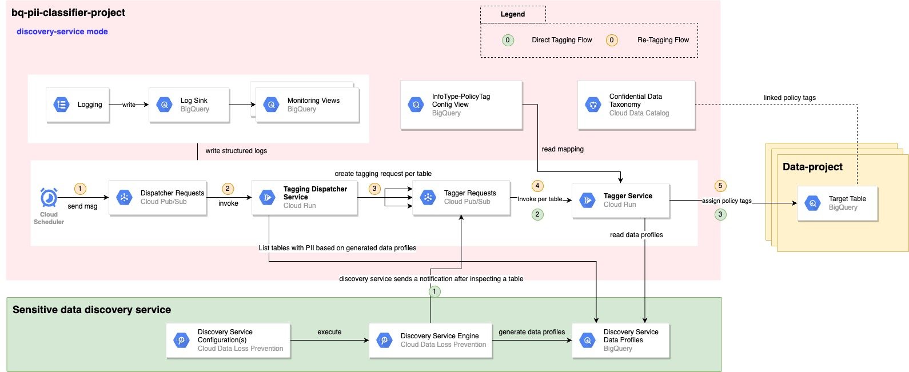
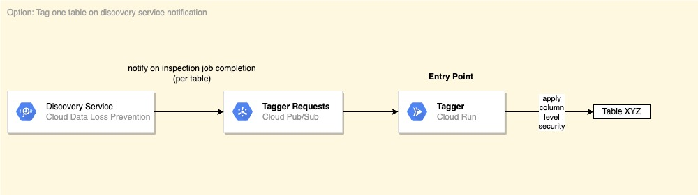
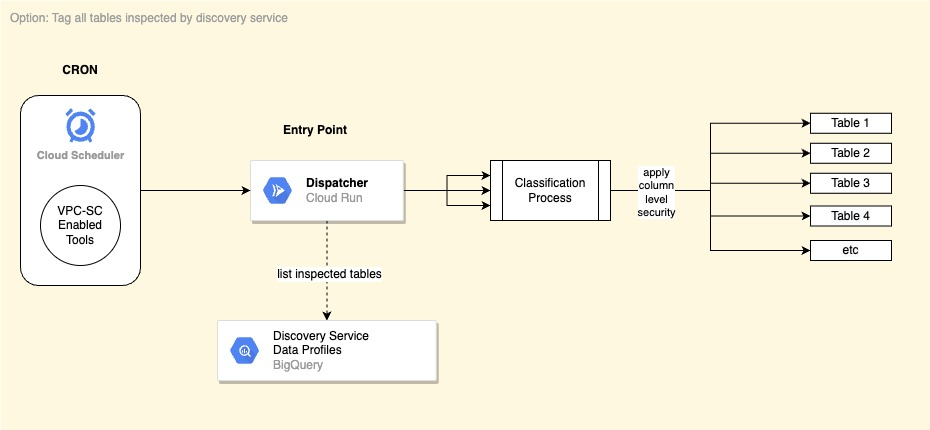

# BigQuery PII Classifier - Discovery-Service Mode

Table of content:
1. [Architecture](#architecture)
2. [Deployment](#deployment)
3. [Manual Usage](#manual-usage)
4. [Reporting](#reporting)
5. [Automated Usage](#automated-usage)

## Architecture



### Components

*Tagging Dispatcher Service:*  
A Cloud Run service that acts as an entry point for the solution. It expects a BigQuery scope expressed as inclusion and exclusion lists of projects, datasets and tables. This scope could be one or more tables.

The Tagging Dispatcher will list all tables included in the scope that has existing findings by sensitive data discovery service and submit a table tagging request for that table in the Tagger Tasks topic.

*Tagger Tasks Topic:*  
This PubSub topic decouples the Tagging Dispatcher from the Tagger service in order to handle the rate limits of BigQuery column tagging operations and to apply auto-retries with backoffs.

*Tagger Service:*  
A Cloud Run service that expects the information of one BigQuery table. It will determine the InfoType of each column based on the latest DLP findings and apply the appropriate policy tag.

*BigQuery Config Views:*  
Terraform will generate config views based on the defined  mappings and configurations. These config views are mainly used by the Tagger service to determine the policy tagging logic.

*Logs:*  
All Cloud Run services are writing structured logs that are exported by a log sink to BigQuery. On top of that there are a number of BigQuery views that help in monitoring and debugging call chains and tagging actions on columns.

## Deployment

### Environment Preparation

Follow the steps in this [document](common-terraform-1-prepare.md) and then continue here.

### Build Cloud Run Services Images

We need to build and deploy docker images to be used by the Cloud Run services.

```
export TAGGING_DISPATCHER_IMAGE=${COMPUTE_REGION}-docker.pkg.dev/${PROJECT_ID}/${DOCKER_REPO_NAME}/bqsc-tagging-dispatcher-service:latest
export TAGGER_IMAGE=${COMPUTE_REGION}-docker.pkg.dev/${PROJECT_ID}/${DOCKER_REPO_NAME}/bqsc-tagger-service:latest

./scripts/deploy_common_services.sh
```

### Terraform Variables Configuration

The solution is deployed by Terraform and thus all configurations are done
on the Terraform side.

#### Configure common variables

Follow the steps in this [document](common-terraform-2-variables.md) and then continue here.

#### Configure discovery-service mode

Configure the solution to be deployed in data-discovery mode and not standard-mode

PS: for backward compatibility, this configuration flag is named after the original API name for this feature `Auto DLP`

```
is_auto_dlp_mode = true
```

#### Configure Cloud Run Service Images

Earlier, we used Docker to build container images that will be used by the solution.
In this step, we instruct Terraform to use these published images in the Cloud Run services
that Terraform will create.

PS: Terraform will just "link" a Cloud Run to an existing image. It will not build the images from the code base (this
is already done in a previous step)

```
tagging_dispatcher_service_image = "< value of env variable TAGGING_DISPATCHER_IMAGE >"
tagger_service_image = "< value of env variable TAGGER_IMAGE >"
``` 

#### Configure discovery service results table

Configure the name of the inspection results table that will be used by discovery service.
Note this table name because it will be used while configuring discovery service outside of Terraform.

```
auto_dlp_results_table_name = "<table>"
```

#### Configure Cloud Scheduler CRON

Configure the schedule on which the solution entry point is invoked.

The `tagging_cron_expression` sets the schedule on which the Tagging Dispatcher service will be invoked.  
This will use the latest DLP findings (i.e. results of discovery service) and apply the policy tags based on the latest
data classification taxonomy.

```
tagging_cron_expression = "0 0 * * *"
```

PS: the current solution has one entry point/scheduler but one can extend the solution
by adding more schedulers that have different BigQuery scope and/or timing.

#### Take Note

Take note of the default or user-defined values for the following
variables as they will be used while configuring discovery service outside this solution in the next section:
* `project`: the host project where we deploy the solution
* `bigquery_dataset_name`: the name of the BigQuery dataset that contains the solution tables and views
* `auto_dlp_results_table_name`: the name of the BigQuery table that discovery service uses to store detailed inspection findings.
* `tagger_pubsub_topic`: the PubSub topic for table tagging requests

PS: If you haven't specified these variables
in your `.tfvars` file you can find the default values in [variables.tf](../terraform/variables.tf)

### Terraform Deployment

Follow the steps in this [document](common-terraform-3-apply.md) and then continue here.


### Configure Discovery Service on GCP

Follow the official [GCP guide](https://cloud.google.com/dlp/docs/data-profiles)
on how to set up scan configurations. Please note the following sections:
* "Select inspection template":  
  Choose the "existing template" option and use the template that is created by the solution via Terraform (found under DLP > Configuration > Templates > Inspect).
  This will enable discovery service to look for the PII types you configured earlier in Terraform.
* "Manage scan outcome":
    * enable "save data profile copies to BigQuery" and use the same `project`, `bigquery_dataset_name` and `auto_dlp_results_table_name` as configured in Terraform.
    * enable "Publish to Pub/Sub" and do the following
        * Select "Send a Pub/Sub notification each time a table is profiled for the first time."
        * Select "Send a Pub/Sub notification each time a profile is updated."
        * For all selected options use these values:
            * Pub/Sub Topic: `projects/<project-id>/topics/<topic-name>.` Where `project-id` and `topic-name` are the values of the Terraform variables `project` and `tagger_pubsub_topic` respectively.
            * Notification Details:  "Resource Name Only"
* "Manage service agent container and billing":
    * Choose "Select an existing service agent container".
    * Enter the host project name (as set in the Terraform variable `project`) in the "Service agent container field"
    * PS: This configuration is only allowed when you set discovery service on an Org or Folder levels.
      If you configure discovery service on project level make sure it's the same as the solution host project or re-deploy the terraform
      module while using the desired DLP service agent in the variable `dlp_service_account`. This important to make sure that the
      DLP service agent gets the required permissions on the solution.

### Post deployment setup

#### Set env variables

Set the following variables that will be used in next steps:

```
export SA_TAGGING_DISPATCHER_EMAIL=tag-dispatcher@${PROJECT_ID}.iam.gserviceaccount.com
export SA_TAGGER_EMAIL=tagger@${PROJECT_ID}.iam.gserviceaccount.com
```

PS: update the SA emails if the default names have been changed in Terraform


#### Configure Discovery Service Results Dataset

You can skip this step if you choose to configure discovery service to store the inspection results in the
BigQuery dataset that was created by Terraform earlier.

Otherwise, you must grant permissions on the inspection results dataset to the deployed solution.

From root folder:
```
export AUTO_DLP_DATASET="<project.dataset.table>"

./scripts/prepare_auto_dlp_results_dataset.sh
```  

#### Configure Data Projects

The application is deployed under a host project as set in the `PROJECT_ID` variable.
To enable the application to tag columns in other projects (i.e. data projects) one must grant a number of
permissions on each data project. To do, run the following script:

From root folder:
```
./scripts/prepare_data_projects_for_auto_dlp_mode.sh <project1> <project2> <etc>
```

PS:
* If you have tables to be inspected in the host project, run the above script and include the host project in the list
* Use the same projects list as set in the Terraform variable `projects_include_list`

## Reporting

Check out this [document](common-reporting.md) for example queries on:
* How to monitor execution steps
* How to detect broken execution steps (e.g. tables that were not tagged)
* Displaying a log of all tagging actions and PII findings by the solution


## Usage

After deploying the solution, one can call it in different ways:

**[Option 1] Discovery Service Notifications:**



After discovery service (re)profiles a table it will send a PubSub notification
to the Tagger service to apply tags to columns with PII. To test this behaviour you could create
apply an action that triggers discovery service to profile or re-profile a table, wait until the target table(s) appears
in the discovery service UI and then manually inspect the table to see if policy tags are applied correctly.   
There are different actions that could trigger discovery service and they are based on the discovery service configuration
you created earlier (in the schedule section) some of them are:
* Create a new table with PII
* Copying an existing one (same as creating new table)
* Adding rows to an already profiled table
* Changing the schema of an already profiled table

PS: discovery service configuration determines the frequency for which DLP (re)profiles a table, it could be
daily or monthly. It's recommended to use "daily" to be able to test the solution on a timely manner
and then switching it to a different schedule if needed for long-term usage.

**[Option 2] CRON Schedules:**



If discovery service already profiled some tables, and you want to (re)tag them (or a subset) you could
use the Cloud Scheduler to trigger a tagging run for the tables that discovery service already profiled.   
Steps:
* In GCP, select the host project
* Go to Cloud Scheduler
* Trigger the "Tagging Scheduler"
* Inspect the status of the run via the queries in the [Reporting section](Reporting).  
  Alternatively you can check the logs of each Cloud Run service or just wait for few minutes.
* Inspect a sample BigQuery table and validate that the policy tags were applied correctly.

In addition, more than one Cloud Scheduler/Trigger could be defined to group tables that have the same inspection schedule (daily, monthly, etc)


## Updating DLP Info Types

Check out this [document](common-managing-dlp-types.md) for
steps on how to add/remove Info Types in the classification taxonomy.


